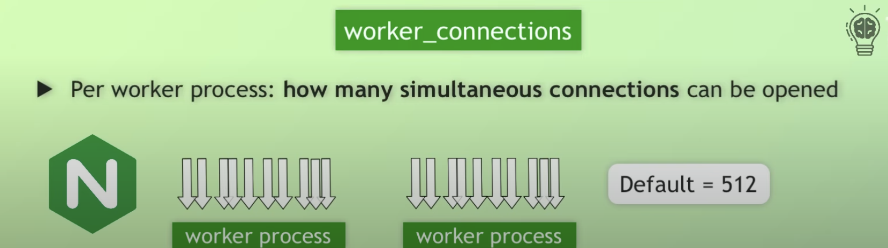
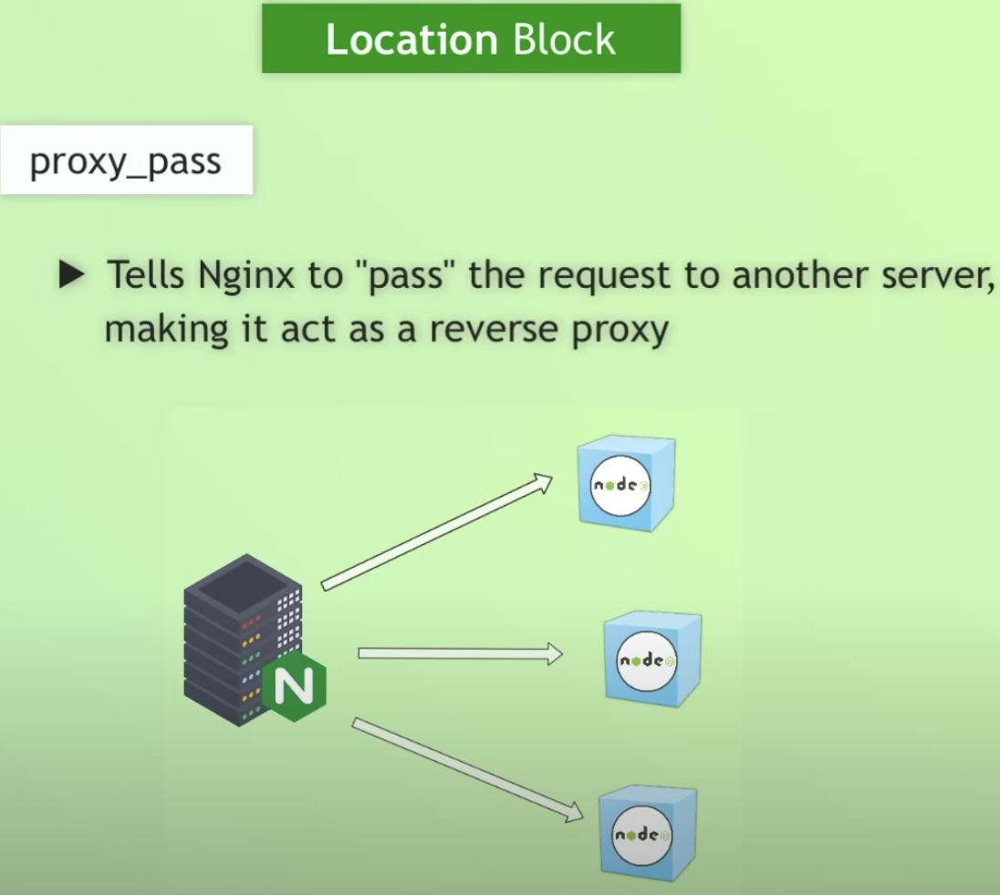

-> The higher the value, the more requests can be handled.

-> location: The root (/) URL, will apply to all requests unless more specific location blocks are defined.

-> Upstream block defines a group of backend servers that will handle requests forwarded by Nginx.

-> mime.types

